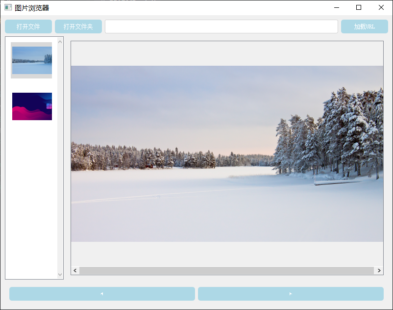
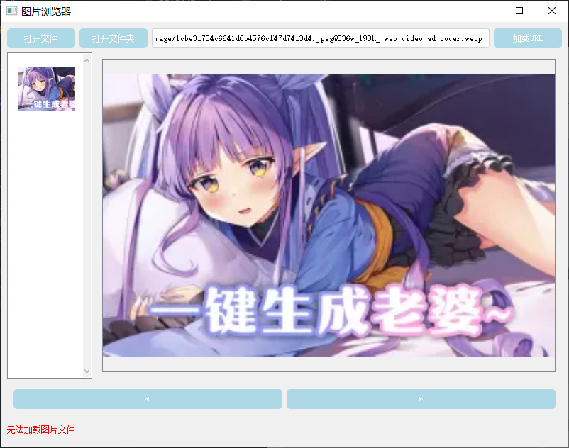

# PyQt5 图片浏览器

## 项目简介
基于PyQt5开发的跨平台图片浏览工具，支持本地文件系统图片浏览和远程URL图片加载，提供缩略图导航、图片缩放、右键保存等核心功能。

## 功能特性
✅ 本地图片浏览
- 支持打开单个图片文件/整个图片文件夹
- 自动生成缩略图导航栏（components/ui_components.py）
- 支持PNG/JPG/JPEG/BMP格式

✅ 远程图片加载
- 支持HTTP/HTTPS URL直接加载（services/network_service.py）
- 自动缓存远程图片到临时目录

✅ 核心功能
- 响应式布局支持窗口缩放
- 鼠标滚轮图片缩放
- 右键菜单另存为功能（utils/image_utils.py）
- 前进/后退导航

## 安装说明
```bash
# 克隆仓库
git clone git@github.com:newbieking/gallery-pyqt5.git

# 进入项目目录
cd gallery-pyqt5

# 安装依赖
pip install PyQt5 shutil
```

## 使用指南
1. **本地图片浏览**
   - 点击`打开文件`选择单个图片
   - 点击`打开文件夹`加载整个图片目录

2. **远程图片加载**
   - 在URL输入框粘贴图片地址
   - 点击`加载URL`按钮

3. **快捷操作**
   - 鼠标滚轮：缩放图片
   - 右键图片：保存当前图片
   - 侧边栏：点击缩略图快速跳转

## 项目结构
```
pyqt5-app/
├── main.py            # 主程序入口
├── components/        # UI组件
│   └── ui_components.py
├── services/          # 网络服务
│   └── network_service.py
└── utils/             # 工具函数
    └── image_utils.py
```

## 运行截图




## 技术支持
遇到问题时请提交issue，包含：
1. 操作系统版本
2. 报错截图
3. 复现步骤